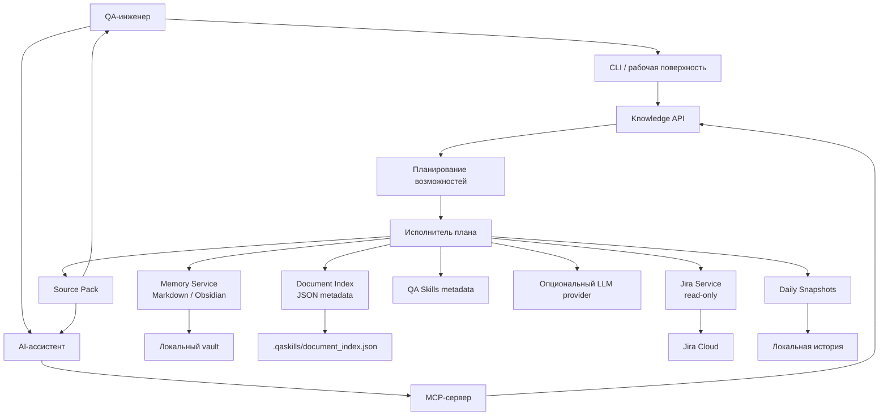
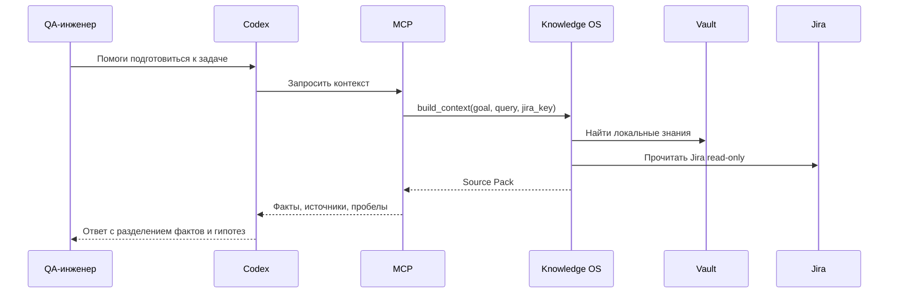

# QA Knowledge OS

Локальный движок знаний для QA-инженера.

*Knowledge Operating System for QA Engineers.*

[](https://github.com/ilya-motion/qa-knowledge-os/actions/workflows/ci.yml)

> ⚙️ Это не попытка сделать “ещё один чат с AI”. Проект показывает, как я строю
> инженерную систему вокруг AI: источники, индексация, контекст, ограничения,
> проверяемость и безопасные границы.

## Что это такое

QA Knowledge OS — это локальный runtime, который превращает Markdown/Obsidian
vault в рабочий источник контекста для QA-задач. Он индексирует знания, читает
Jira в read-only режиме, готовит source pack для AI-ассистента и помогает
быстро восстановить контекст по задаче, багу или ежедневной работе.

Проект находится в состоянии portfolio-ready MVP: он не претендует на идеальный
продукт, но показывает архитектурный подход к автоматизации QA-процессов.

## Почему появился проект

Во время QA-работы я регулярно сталкивался с одной и той же проблемой: знания
были разбросаны между Jira, Obsidian, заметками, переписками, старыми
исследованиями и локальными файлами.

Каждое утро приходилось заново вспоминать:

- что изменилось со вчера;
- какие задачи требуют внимания;
- где лежат прошлые решения;
- какие риски уже обсуждались;
- что нужно проверить в первую очередь.

Мне хотелось не просто “спросить AI”, а дать AI нормальную инженерную опору:
индекс, источники, правила, контекст и безопасные границы. Так появился QA
Knowledge OS.

## Какую проблему я решал

Обычный AI-чат получает текстовый prompt и начинает отвечать. Для QA этого
мало: без источников он может уверенно ошибаться, забывать ограничения проекта
или смешивать факты с предположениями.

Я хотел систему, которая сначала собирает evidence, а уже потом помогает
рассуждать:

| Проблема | Что делает QA Knowledge OS |
| --- | --- |
| Знания разбросаны | Индексирует Markdown/Obsidian vault |
| Jira быстро меняется | Делает read-only снимки и сравнение изменений |
| AI может выдумывать | Возвращает source pack и явно показывает источники |
| Контекст теряется | Готовит daily/task context за одну команду |
| Нельзя рисковать внешними действиями | Jira-интеграция только read-only |

## Почему обычные инструменты не устроили

- Jira показывает текущие задачи, но не объясняет прошлый контекст.
- Obsidian хранит знания, но сам по себе не является рабочим runtime.
- Поиск по файлам находит текст, но не собирает рабочий контекст.
- AI-чат помогает формулировать мысли, но без источников легко ошибается.
- RAG/векторная база была бы преждевременной сложностью для MVP.

Поэтому я сделал локальный knowledge engine: простой, проверяемый, управляемый и
понятный.

## Какое решение получилось

Система принимает рабочий запрос, собирает релевантные источники, при
необходимости читает Jira, поднимает локальную память и возвращает структурный
пакет контекста для Codex или другого AI-ассистента.

Главная идея: **AI не должен быть источником истины. AI должен работать поверх
источников истины.**

## Основные возможности

- 📚 Индексация Markdown/Obsidian vault.
- 🔎 Поиск по заголовкам, тегам, alias, путям и структуре документов.
- 🧭 Source Pack: источники, причины совпадения и порядок чтения.
- 🧩 MCP-сервер для подключения к AI-ассистентам.
- 🧾 Read-only Jira-интеграция.
- 📆 Daily snapshots и сравнение изменений.
- 🧠 Подготовка контекста для daily, задачи, бага или регрессии.
- 🛡️ Fallback без LLM: если модель недоступна, система всё равно возвращает
  полезный локальный контекст.
- ✅ Автотесты для runtime-слоя.

## Архитектура



### Граница ответственности



## Как выглядит работа

```bash
python3 -m venv .venv
.venv/bin/python -m pip install -r requirements.txt

export QASKILLS_MEMORY_VAULT_PATH="./demo/vault"
export QASKILLS_DOCUMENT_INDEX_PATH=".qaskills/document_index.json"

./qaskills doctor
./qaskills find authorization
./qaskills ask "Что мы знаем про авторизацию?"
./qaskills prepare daily
```

## Скриншоты

Скриншоты пока не добавлены в репозиторий, чтобы не публиковать локальные
данные. Точный список кадров лежит в [docs/screenshots.md](docs/screenshots.md).

| Что снять | Что должно быть видно |
| --- | --- |
| Структура проекта | `app/`, `tests/`, `docs/`, `demo/`, CI |
| `./qaskills doctor` | Проверка готовности vault/index/provider |
| `./qaskills find authorization` | Source Pack и причины совпадения |
| `./qaskills prepare daily` | Сбор daily-контекста |
| GitHub Actions | Зелёный lint/tests pipeline |

## GIF

GIF-сценарий на 30-40 секунд описан в [docs/gif-demo.md](docs/gif-demo.md).

Короткая идея: показать, как за несколько команд система превращает локальные
знания и Jira-контекст в рабочий Source Pack для AI.

## Что реализовано сейчас

- [x] CLI entrypoint.
- [x] Индексация Markdown-документов.
- [x] Поиск по metadata.
- [x] Knowledge API.
- [x] MCP-сервер.
- [x] Read-only Jira boundary.
- [x] Daily snapshots.
- [x] Optional LLM provider boundary.
- [x] Регрессионные тесты.
- [x] CI: lint + tests.
- [x] Обезличенные demo-данные.

## Что будет дальше

- Упаковка CLI для установки одной командой.
- Более явный `demo mode` без реальной Jira.
- HTML-отчёт Source Pack.
- Визуальная страница “утреннего контекста”.
- Больше integration-тестов вокруг MCP и Jira failures.

## Почему проект интересен инженеру

В этом проекте важен не объём кода, а подход:

- AI встроен в workflow, а не приклеен сверху;
- источники важнее генерации;
- внешний мир читается безопасно;
- система умеет деградировать без LLM;
- архитектура разделяет runtime, знания и reasoning;
- тесты проверяют границы, а не только happy path.

## Ограничения проекта

- Jira-интеграция intentionally read-only.
- Нет полноценного semantic search или vector DB.
- Нет packaged installer.
- Demo-данные обезличены и не отражают весь реальный рабочий контекст.
- UI пока CLI-first.

## Roadmap

| Версия | Фокус |
| --- | --- |
| v0.1 | Локальный index, search, Source Pack |
| v0.2 | Daily snapshots, Jira read-only, MCP |
| v0.3 | Demo mode, HTML report, улучшенная диагностика |
| v0.4 | Packaging и публичный пример end-to-end workflow |

## GitHub

**Описание:** `Локальный QA Knowledge OS: Markdown-память, Jira snapshots, Source Pack и MCP-контекст для AI-assisted QA.`

**Topics:** `qa`, `quality-assurance`, `ai-automation`, `knowledge-management`,
`obsidian`, `markdown`, `jira`, `mcp`, `local-first`, `python`,
`engineering-portfolio`

## Лицензия

MIT. См. [LICENSE](LICENSE).
